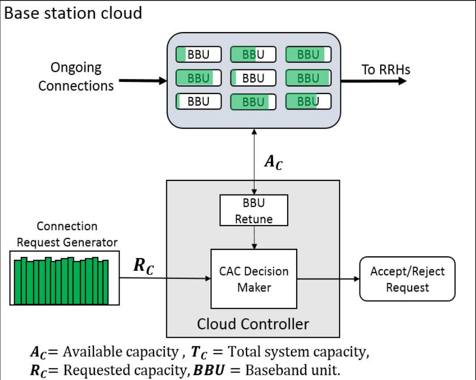
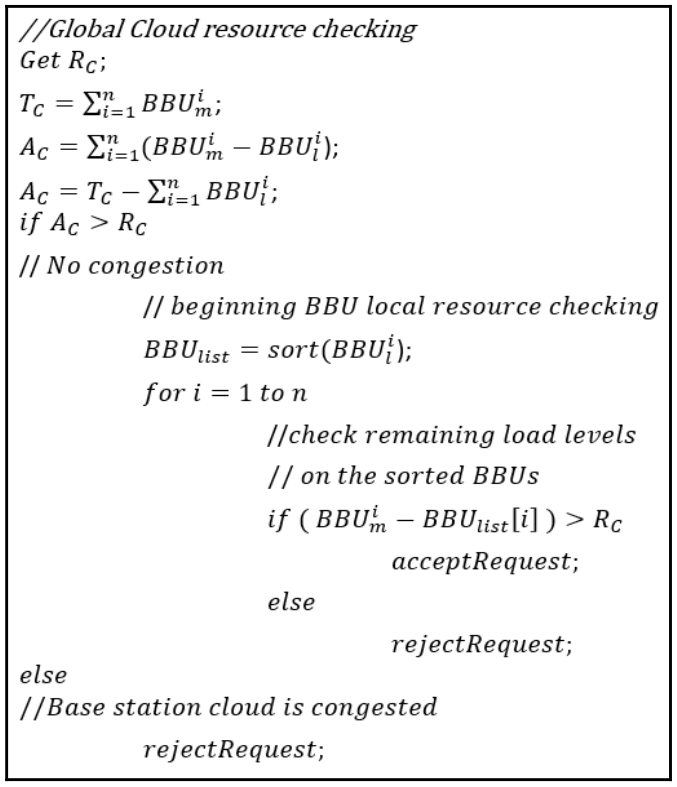

# C-RAN CAC Algorithm (Python implementation)
This repository contains the python implementation of **Call Admission Control in Cloud Radio Access Networks Algorithm**, a paper writing by [Tshiamo Sigwele, Prashant Pillai, Yim Fun Hu](http://ieeexplore.ieee.org/document/6984171)

### CAC Model:

### CAC Algorithm:

